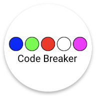

<!-- PROJECT SHIELDS -->
<!--
*** https://www.markdownguide.org/basic-syntax/#reference-style-links
-->
[![Contributors][contributors-shield]][contributors-url]
[![Forks][forks-shield]][forks-url]
[![Stargazers][stars-shield]][stars-url]
[![Issues][issues-shield]][issues-url]
[![MIT License][license-shield]][license-url]

<!-- PROJECT LOGO -->
 

  

<h3 align="center">Code Breaker!</h3>

  

    A playground game/app to explore Kotlin and Compose Multiplatform

Currently targets Android TV (with dpad and numpad rcu support), Android Tablets, Mac / Windows / Linux Desktop
 
    <a href="https://github.com/tpakis/codebreak"><strong>Explore the docs »</strong></a>
     
     
    ·
    <a href="https://github.com/tpakis/codebreak/issues">Report Bug</a>
    ·
    <a href="https://github.com/tpakis/codebreak/issues">Request Feature</a>
  

<!-- TABLE OF CONTENTS -->

  
Table of Contents

  <ol>
    <li>
      <a href="#about-the-project">About The Project</a>
      <ul>
        <li><a href="#built-with">Built With</a></li>
        <li><a href="#Runs-on">Runs On</a></li>
      </ul>
    </li>
    <li>
      <a href="#getting-started">Getting Started</a>
      <ul>
        <li><a href="#prerequisites">Prerequisites</a></li>
        <li><a href="#how-to-run">How To Run</a></li>
      </ul>
    </li>
    <li><a href="#usage">Usage</a></li>
    <li><a href="#roadmap">Roadmap</a></li>
    <li><a href="#contributing">Contributing</a></li>
    <li><a href="#license">License</a></li>
    <li><a href="#Acknowledgments">Acknowledgments</a></li>
    <li><a href="#contact">Contact</a></li>
  </ol>

<!-- ABOUT THE PROJECT -->
## About The Project
The main target platform for this game is Android TV. It was specifically designed with dpad navigation in mind 
to investigate solutions for better focus handling. Set top boxes with complete remote controls, that have full numpad
are even better supported since the colors of the digits are mapped to the numpad buttons from 1-8 . 

Android Tablets are also supported, but with touch navigation and interaction since dpad is missing.

Desktop is a secondary platform and is an area where a lot of improvements can be made. The use of Compose Multiplatform
for the desktop version, enables future expansion into Web TVs and possibly also Apple TV with Swift being the next alternative
for Apple UI.

All the game logic for every application version is contained in `commonMain` module of the Kotlin Multiplatfrom `library` module. It is extensively covered
with unit tests to ensure the correct functionality and future extensibility and maintenance.

Translations for both project apps are added in a different `translations` module. Currently only two languages are supported, English as
the default one, and Greek. Of course in the future, other translations can be added. The solution chosen for translations is a
completely custom one using composition local to pass the translated strings to the different composables, and does not use Android 
resource files or xml.

### Screenshots
[![codebreak Screen Shot][product-screenshot]](https://github.com/tpakis/codebreak)
 

### Built With

[![Kotlin Multiplatform][Kotlin]][Kotlin-url] [![Jetpack Compose][Compose]][Compose-url] [![Compose Multiplatform][Compose-desktop]][Compose-desktop-url]

### Runs On

[![Android TV][Android-tv]][Kotlin-url] [![Android][Android]][Kotlin-url] [![Mac os][Macos]][Kotlin-url] [![Linux][linux]][Kotlin-url] [![Windows][Windows]][Kotlin-url]

(<a href="#readme-top">back to top</a>)

<!-- GETTING STARTED -->
## Getting Started

### Prerequisites
* Java : Please check if Java is installed. This is a very useful [guide](https://www.baeldung.com/java-check-is-installed)
* Android Studio / Intellij IDEA : How to install can be found in this [guide](https://developer.android.com/studio/install) or for intellij IDEA [guide](https://www.jetbrains.com/help/idea/installation-guide.html)

### How To Run

**Desktop**

!!**Warning**!! Run from the terminal using the following commands. Running from the gutter in IDEA leads to issues with run 
configurations and `ClassNotFoundException` exceptions!
- `./gradlew run` - run application 
- `./gradlew package` - package native distribution into `build/compose/binaries`

**Android**
- `./gradlew installDebug` - install Android application on an Android device (on a real device or on an emulator)

Running from the IDE also works as expected on Android.

(<a href="#readme-top">back to top</a>)

<!-- USAGE EXAMPLES -->
## Usage
This game is based on the well known board game, you can read the detailed rules and instruction on how to play it [here](https://en.wikipedia.org/wiki/Mastermind_(board_game))

In short, the goal is to correctly guess the code the game randomly selected, as fast as possible and with as less tries as possible.
In the board game version, it is played with 2 players, one selects the code and the second tries to guess it. This is a single player version vs the computer.
 

[![codebreak Video][product-video]](https://github.com/tpakis/codebreak)

(<a href="#readme-top">back to top</a>)

<!-- ROADMAP -->
## Roadmap

This project is a learning playground, so a place for exploring new ideas and new technologies. 

This is a (non-extensive or prioritized) list of possible future improvements, investigations, things I would like to try out

- [ ] Extend the game options, to play with custom rules
- [ ] Extend gameplay with more than 5 colors
- [ ] Add local storage for game statistics
- [ ] Polish UI
- [ ] Add Animations
- [ ] Add Sound Effects
- [ ] Investigate common DI framework usage as the code grows
- [ ] More Translations
- [ ] Explore Jetpack Navigation
- [ ] Android Mobiles support, with UI adjustments
- [ ] iOS Support
    - [ ] Apple Tv Support
    - [ ] Compose for iOS
- [ ] Support for other TV platforms like Tizen through Compose for Web
- [ ] Enhance keyboard navigation support for Desktop apps
- [ ] Github Actions pipeline to run unit / ui tests
- [ ] E2E Maestro tests
- [ ] Extract common ui parts into a separate module using compose muliplatform also for Android

See the [open issues](https://github.com/github_username/repo_name/issues) for a full list of proposed features (and known issues).

(<a href="#readme-top">back to top</a>)

<!-- CONTRIBUTING -->
## Contributing

Contributions are what make the open source community such an amazing place to learn, inspire, and create. Any contributions you make are **greatly appreciated**.

If you have a suggestion that would make this better, please fork the repo and create a pull request. You can also simply open an issue with the tag "enhancement".
Don't forget to give the project a star! Thanks again!

1. Fork the Project
2. Create your Feature Branch (`git checkout -b feature/AmazingFeature`)
3. Commit your Changes (`git commit -m 'Add some AmazingFeature'`)
4. Push to the Branch (`git push origin feature/AmazingFeature`)
5. Open a Pull Request

(<a href="#readme-top">back to top</a>)

<!-- LICENSE -->
## License

Distributed under the MIT License. See [`LICENCE.md`][license-url] for more information.

(<a href="#readme-top">back to top</a>)

<!-- ACKNOWLEDGMENTS -->
## Acknowledgments
* [Best-README-Template by Othneil Drew](https://github.com/othneildrew/Best-README-Template)
* [Choose an Open Source License](https://choosealicense.com)
* [Img Shields](https://shields.io)
* [GitHub Pages](https://pages.github.com)
* [GitHub Profile Badges](https://home.aveek.io/GitHub-Profile-Badges/)

(<a href="#readme-top">back to top</a>)

<!-- CONTACT -->
## Contact

Thanos Tsakiridis

[![Mastodon][Mastodon]][Mastodon-url] [@thanos@androiddev.social](https://androiddev.social/@thanos)

[![Github Pages][pages]][pages-url]

[![Medium][medium]][medium-url]

Project Link: [https://github.com/tpakis/codebreak](https://github.com/tpakis/codebreak)

(<a href="#readme-top">back to top</a>)

<!-- MARKDOWN LINKS & IMAGES -->
<!-- https://www.markdownguide.org/basic-syntax/#reference-style-links -->
[contributors-shield]: https://img.shields.io/github/contributors/tpakis/codebreak.svg?style=for-the-badge
[contributors-url]: https://github.com/tpakis/codebreak/graphs/contributors
[forks-shield]: https://img.shields.io/github/forks/tpakis/codebreak.svg?style=for-the-badge
[forks-url]: https://github.com/tpakis/codebreak/network/members
[stars-shield]: https://img.shields.io/github/stars/tpakis/codebreak.svg?style=for-the-badge
[stars-url]: https://github.com/tpakis/codebreak/stargazers
[issues-shield]: https://img.shields.io/github/issues/tpakis/codebreak.svg?style=for-the-badge
[issues-url]: https://github.com/tpakis/codebreak/issues
[license-shield]: https://img.shields.io/github/license/tpakis/codebreak.svg?style=for-the-badge
[license-url]: https://github.com/tpakis/codebreak/blob/master/LICENCE.md
[product-screenshot]: readme_assets/screenshot.png
[product-video]: readme_assets/video.gif
[pages-url]: https://tpakis.github.io/
[pages]: https://img.shields.io/badge/GitHub%20Pages-222222.svg?style=for-the-badge&logo=GitHub-Pages&logoColor=white
[medium-url]: https://thanasakis.medium.com/
[medium]: https://img.shields.io/badge/Medium-000000.svg?style=for-the-badge&logo=Medium&logoColor=white
[Mastodon-url]: https://androiddev.social/@thanos
[Mastodon]: https://img.shields.io/badge/Mastodon-6364FF.svg?style=for-the-badge&logo=Mastodon&logoColor=white
[Compose-desktop-url]: https://www.jetbrains.com/lp/compose-mpp/
[Compose-desktop]: https://img.shields.io/badge/Compose_multiplatform-000000.svg?style=for-the-badge&logo=JetBrains&logoColor=white
[Kotlin-url]: https://kotlinlang.org/docs/multiplatform.html
[Kotlin]: https://img.shields.io/badge/kotlin_Multiplatform-%237F52FF.svg?style=for-the-badge&logo=kotlin&logoColor=white
[Compose-url]: https://developer.android.com/jetpack/compose
[Compose]: https://img.shields.io/badge/Jetpack%20Compose-4285F4.svg?style=for-the-badge&logo=Jetpack-Compose&logoColor=white

[android-tv]: https://img.shields.io/badge/Android_TV-3DDC84.svg?style=for-the-badge&logo=Android&logoColor=white
[android]: https://img.shields.io/badge/Android-3DDC84.svg?style=for-the-badge&logo=Android&logoColor=white
[windows]: https://img.shields.io/badge/Windows-0078D6.svg?style=for-the-badge&logo=Windows&logoColor=white
[macos]: https://img.shields.io/badge/macOS-000000.svg?style=for-the-badge&logo=macOS&logoColor=white
[linux]: https://img.shields.io/badge/Linux-FCC624.svg?style=for-the-badge&logo=Linux&logoColor=black